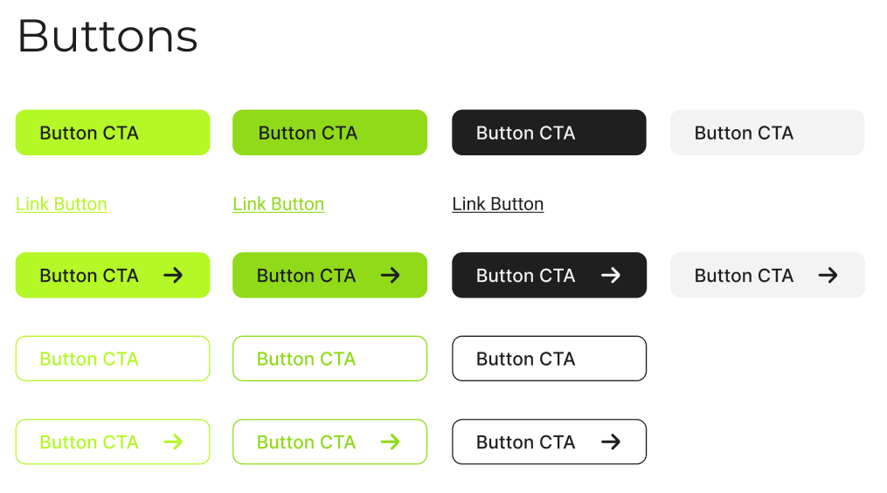

# React.JS + TailwindCSS Framework Components

Reusable components developed for React.js applications, enhancing their versatility with Tailwind CSS.

## Description
This repository hosts a project focused on the development of reusable components for React applications, powered by the versatility and efficiency of Tailwind CSS. The combination of React and Tailwind CSS enables agile construction of modern and stylish user interfaces.

## Components
- Buttons
  - Filled Buttons
  - Filled Icon Buttons
  - Outlined Buttons
  - Outlined Icon Buttons
  - Link Buttons
  
- Banners
- Forms
- Warnings
- Cards
- Navigation
- Icons
- Modals / Popover
- Lists
- Sliders / Carousel
- Tabs
- Progress Bars
- Calendars
- Maps
- Animations

## Style Guide
- [Figma Design - Style Guide from Components](https://www.figma.com/file/tLVmVhMO7T6GqCtdF7ZcVy/Style-Guide?type=design&node-id=2%3A17&mode=design&t=EmDdaSNWFYorEub7-1)

## Contributors and Titles
- [Paul Isaac Torres Enriquez]() - UI Designer and FrontEnd Dev
- [Julio Cesar Rivera Yanes]() - FrontEnd Dev